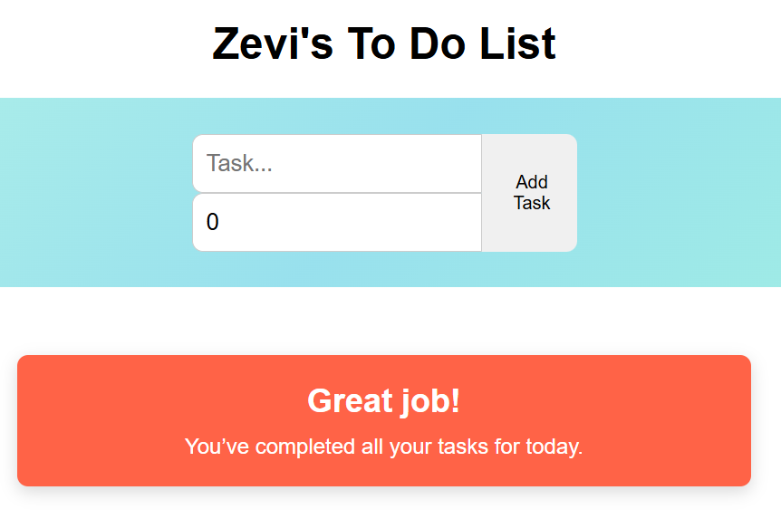
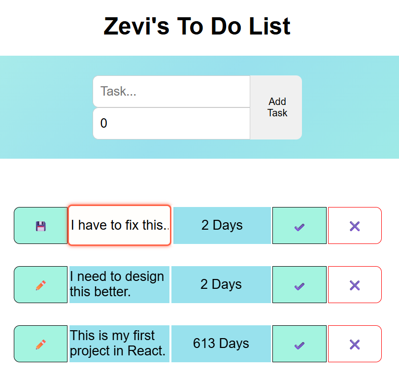

# Zevi's First React + Vite + TypeScript Project

## 📌 Project Description

This is my very first project using **React**, **Vite**, and **TypeScript**. The app is a simple and clean **To-Do List** that lets users add tasks with a deadline, mark them as completed, edit task names, and remove tasks.

It was built as a learning experience to dive into TypeScript with React and to explore modern front-end development workflows using Vite.

---

## 👨‍💻 About the Developer

**Name:** Zevi Friedman
**Role:** Full Stack Developer
**Mission:** Learn, build, and grow in the world of modern web development. This project marks the start of my React+TypeScript journey!

---

## 🛠️ Technologies Used

* React
* Vite
* TypeScript
* CSS Modules

---

## 🚀 Features

* Add new tasks with a name and deadline
* Mark tasks as complete/incomplete
* Edit task names
* Delete tasks
* Visual feedback when all tasks are completed

---

## 📂 Folder Structure Overview

```
my-project/
│
├── src/
│   ├── components/
│   │   ├── TodoTask.tsx
│   │   ├── TaskInput.tsx
│   │   └── EmptyMessage.tsx
│   ├── interfaces.ts
│   ├── App.tsx
│   └── App.css
├── index.html
├── package.json
└── tsconfig.json
```

---

## 🖼️ Screenshots

### Home Screen



### Completed Tasks View



---

## 💡 Future Improvements

* Add task priority levels (high, medium, low)
* Add task due time (in addition to day count)
* Use local storage or backend to persist tasks
* Implement drag-and-drop sorting

---

## 📬 Feedback

Feel free to reach out and share your thoughts. I’m always looking to improve and learn from others.

Thanks for checking out my first React+TypeScript project! 🙌
